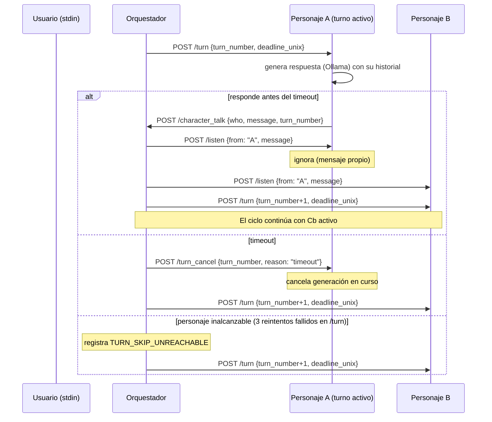
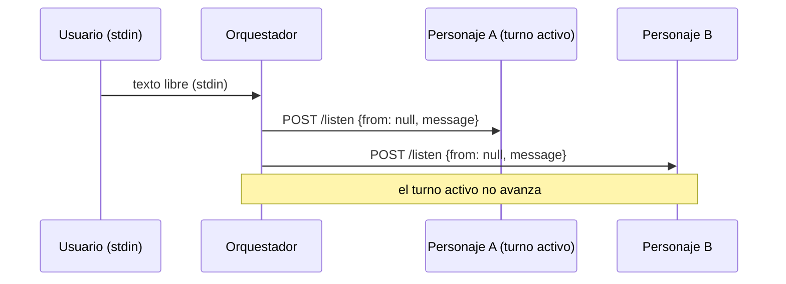
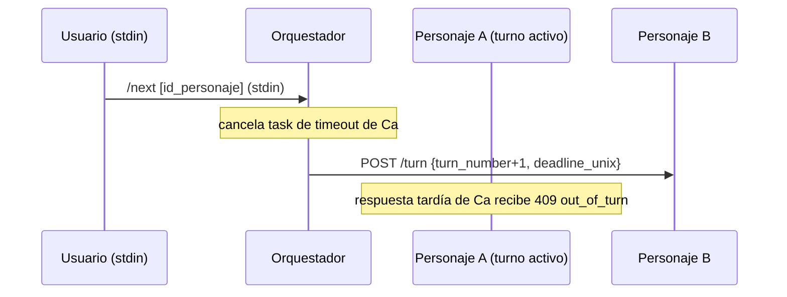
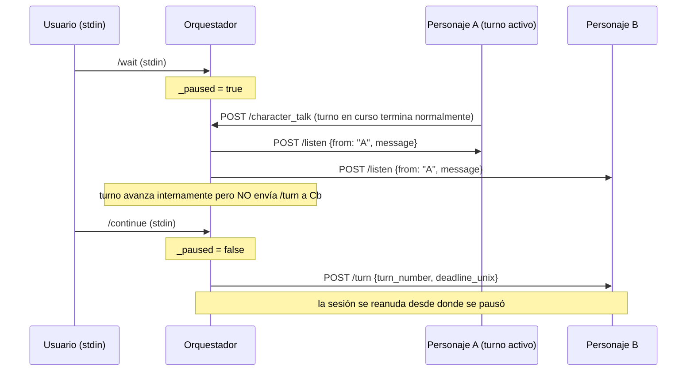

# PerSSim — Sistema de interacción multi-agente: Diseño técnico

## 1. Visión general

El sistema usa un único modo de interacción: **turnos secuenciales controlados por el orquestador**.

- El orquestador define el orden con `turn_order`.
- Cada turno tiene timeout central `turn_timeout_seconds`.
- Los personajes no tienen temporizadores locales.
- Un personaje solo genera respuesta cuando recibe `POST /turn`.
- Cada personaje mantiene su propia memoria de conversación (historial de mensajes).

## 2. Arranque de sesión

```mermaid
sequenceDiagram
    participant L as Launcher
    participant O as Orquestador
    participant Ca as Personaje A
    participant Cb as Personaje B

    L->>O: lanza proceso (perssim.orchestrator)
    L->>Ca: lanza proceso (perssim.char)
    L->>Cb: lanza proceso (perssim.char)

    loop health check hasta OK (max 60s)
        L->>O: GET /status
        L->>Ca: GET /status
        L->>Cb: GET /status
    end

    L->>O: POST /narrate {initial_situation}
    Note over L: Launcher termina aquí

    O->>Ca: POST /listen {from: null, message: initial_situation}
    O->>Cb: POST /listen {from: null, message: initial_situation}
    O->>Ca: POST /turn {turn_number: 1, deadline_unix}
    Note over O,Cb: Los turnos arrancan; orquestador sigue corriendo
```

> Si `initial_situation` está vacío, el orquestador arranca el primer turno directamente al levantarse, sin esperar `/narrate`.

## 3. Ciclo de turno



## 4. Intervención del usuario durante la sesión

### Narración libre



### Forzar avance de turno (`/next`)



### Pausar y reanudar (`/wait` / `/continue`)



## 5. Memoria individual de personaje

Cada personaje mantiene una pila de mensajes propia (`history`) que representa su perspectiva de la conversación:

- **Mensajes recibidos** (via `/listen`, de otros personajes o del narrador) → `role: "user"`
- **Mensajes propios** generados → `role: "assistant"`
- El personaje **ignora** los broadcasts de sus propios mensajes (ya están en historia como `role: "assistant"`).

Esta pila se usa directamente como el array `messages` en cada petición a Ollama, simulando una sesión conversacional continua desde el punto de vista del personaje.

El parámetro `max_character_history` limita el tamaño de esta pila: cuando se alcanza el máximo, se elimina el mensaje más antiguo antes de añadir el nuevo.

## 6. Endpoints

### Orquestador (`port: 5000` por defecto)

| Endpoint | Método | Descripción |
|---|---|---|
| `/character_talk` | POST | Recibe intervención del personaje activo; rechaza fuera de turno con 409. |
| `/next` | POST | Fuerza avanzar al siguiente turno o al personaje indicado en `force_to`. |
| `/turn_status` | GET | Estado actual: `turn_order`, personaje actual, número de turno, deadline. |
| `/narrate` | POST | Envía narración a todos los personajes via `/listen` y arranca el primer turno. |
| `/status` | GET | Health check del orquestador. |

### Personaje (`port`: definido en `char.config.json`)

| Endpoint | Método | Descripción |
|---|---|---|
| `/listen` | POST | Añade mensaje recibido al historial (`role: "user"`); ignora mensajes propios. |
| `/turn` | POST | Arranca generación asíncrona con el historial actual. |
| `/turn_cancel` | POST | Cancela la generación en curso; evita publicar respuestas tardías. |
| `/status` | GET | Estado del personaje: turno activo, última intervención, número de turnos. |

## 7. Configuración

### `session.config.json`

Fichero principal de sesión. Leído por el launcher y el orquestador.

```json
{
  "session_id": "session_001",
  "log_path": "./logs/session_001.log",
  "max_character_history": 20,
  "ollama_debug": false,
  "ollama_debug_log": "./logs/session_001_ollama.json",
  "initial_situation": "París, 1635...",
  "turn_order": ["richelieu", "mazarin"],
  "turn_timeout_seconds": 60,
  "characters": [
    { "id": "richelieu", "host": "localhost", "port": 5001, "config": "./chars/richelieu.config.json" },
    { "id": "mazarin",   "host": "localhost", "port": 5002, "config": "./chars/mazarin.config.json" }
  ]
}
```

| Parámetro | Tipo | Descripción |
|---|---|---|
| `session_id` | string | Identificador de la sesión (libre). |
| `log_path` | string | Ruta al log de diálogo. Relativa al directorio del config. Se añade sufijo numérico si ya existe. |
| `max_character_history` | int | Máx. mensajes en la memoria de cada personaje. `0` = ilimitado. Por defecto: `0`. |
| `ollama_debug` | bool | Si `true`, vuelca peticiones/respuestas Ollama en un fichero JSON aparte. |
| `ollama_debug_log` | string | Ruta al fichero de debug Ollama. Se añade sufijo numérico si ya existe. |
| `initial_situation` | string | Narración inicial enviada a todos los personajes antes del primer turno. |
| `turn_order` | list[string] | IDs de personajes en orden de turno; se rota en bucle. Obligatorio. |
| `turn_timeout_seconds` | int | Segundos máximos de espera por turno antes de pasar al siguiente. |
| `characters[].id` | string | ID único del personaje; debe coincidir con los de `turn_order`. |
| `characters[].host` | string | Hostname del servidor del personaje. |
| `characters[].port` | int | Puerto del servidor del personaje. |
| `characters[].config` | string | Ruta al `char.config.json` del personaje (relativa al session config). |

### `char.config.json`

Configuración individual de cada personaje. Leído por el proceso `perssim.char`.

```json
{
  "character_id": "richelieu",
  "bundle_path": "./bundles/Bundle_Richelieu.md",
  "ollama_model": "llama3",
  "ollama_host": "http://localhost:11434",
  "orchestrator_host": "http://localhost:5000",
  "port": 5001
}
```

| Parámetro | Tipo | Descripción |
|---|---|---|
| `character_id` | string | ID único del personaje; debe coincidir con el de `session.config.json`. |
| `bundle_path` | string | Ruta al Bundle Markdown del personaje. Relativa al directorio del char config. |
| `ollama_model` | string | Modelo Ollama a usar (ej: `llama3`, `gemma3:latest`). |
| `ollama_host` | string | URL base del servidor Ollama. Por defecto: `http://localhost:11434`. |
| `orchestrator_host` | string | URL base del orquestador. Por defecto: `http://localhost:5000`. |
| `port` | int | Puerto en el que correrá el servidor de este personaje. |

> `ollama_debug`, `ollama_debug_log` y `max_character_history` se propagan desde `session.config.json` vía el launcher; no es necesario definirlos en `char.config.json`.

## 8. Reglas de validación de turno

- Si `who` en `/character_talk` no coincide con el personaje del turno actual → `409 out_of_turn`.
- Si `turn_number` no coincide con el turno esperado → `409 turn_number_mismatch`.
- En timeout: se registra `TURN_TIMEOUT`, se envía `/turn_cancel` y se avanza.
- Si un personaje es inalcanzable tras reintentos: se registra `TURN_SKIP_UNREACHABLE` y se avanza.
- Respuestas vacías o nulas no se registran ni se emiten al orquestador.
