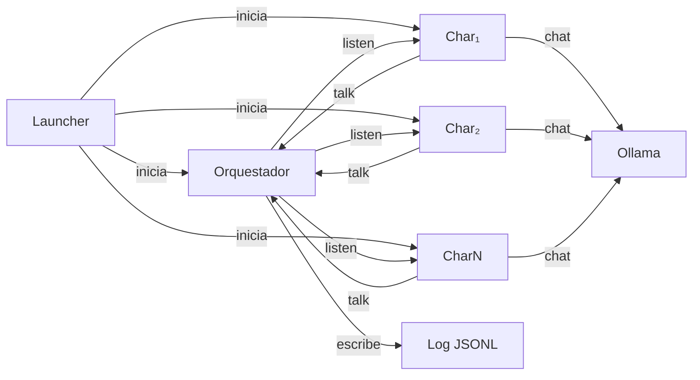
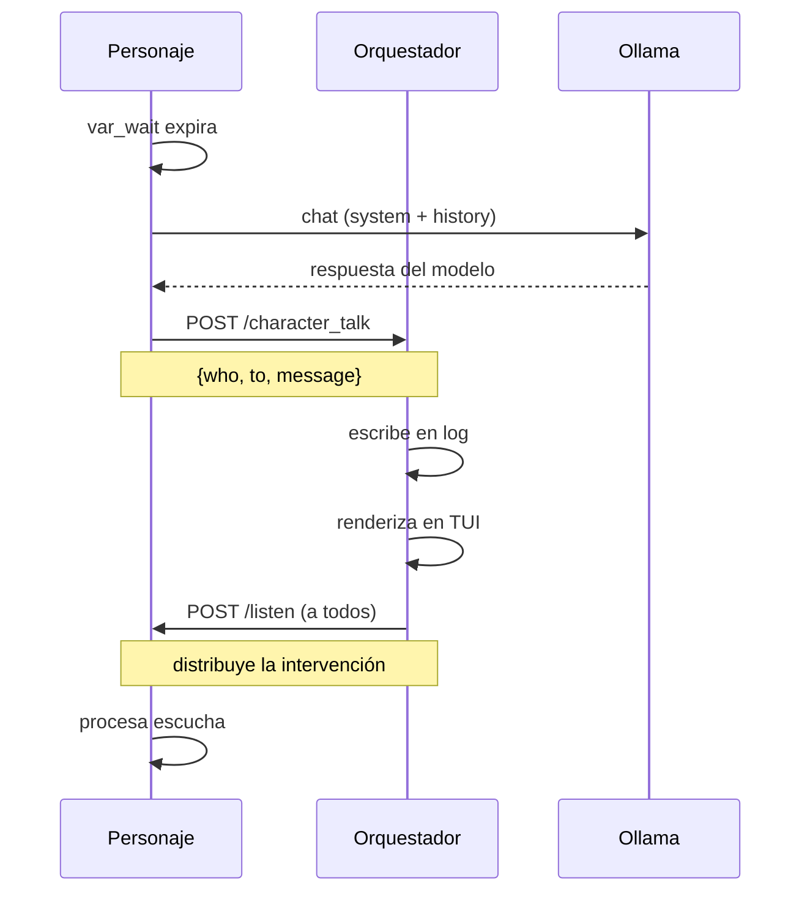
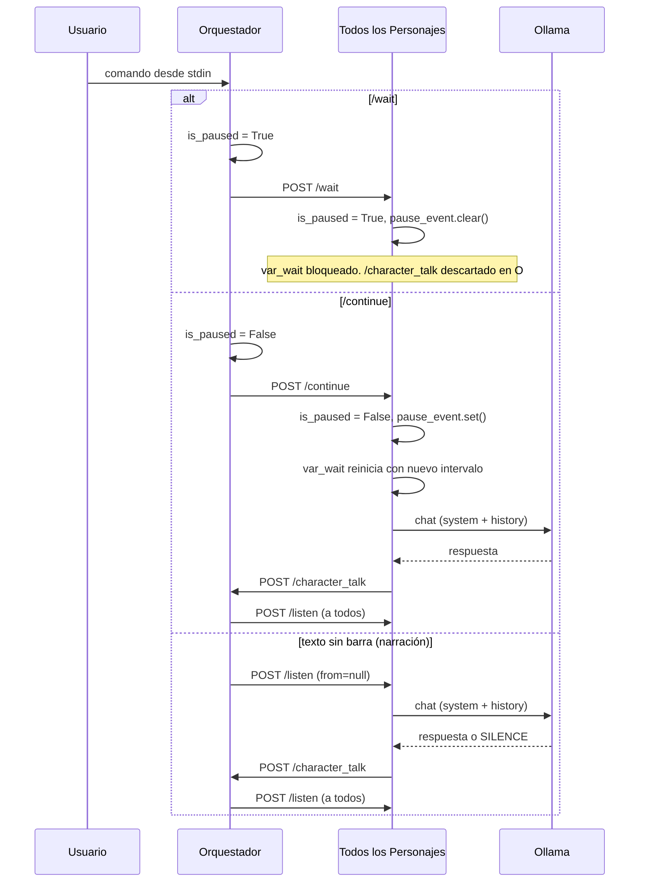
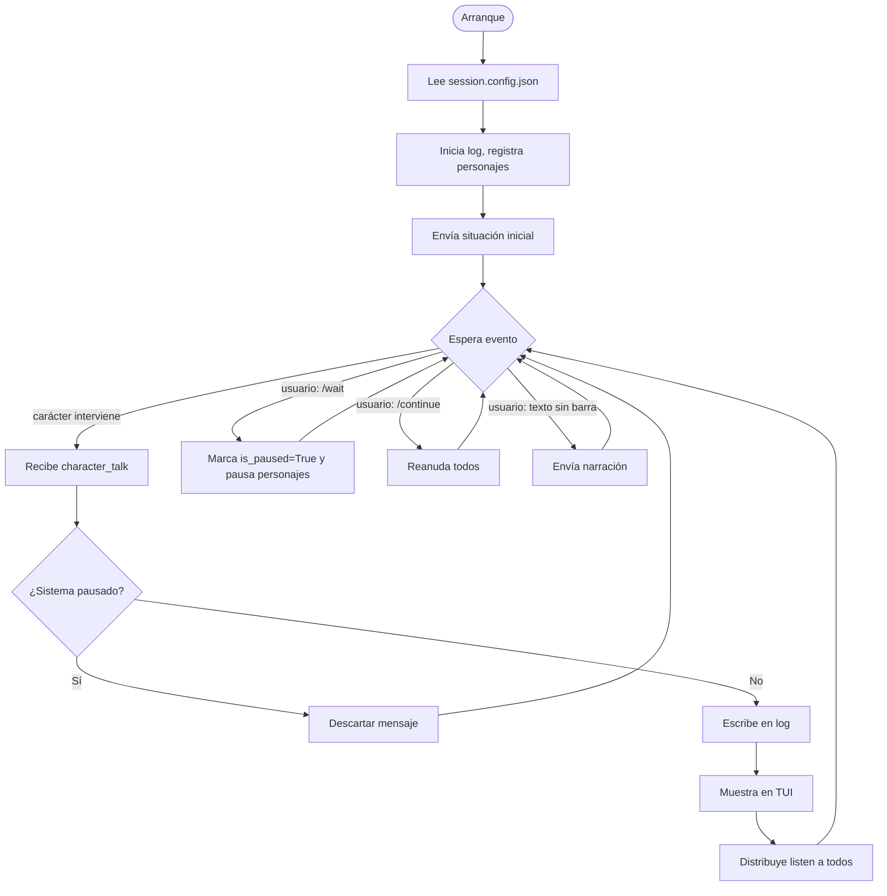

# PerSSim — Sistema de interacción multi-agente: Diseño técnico

## 1. Visión general

El sistema permite instanciar varios personajes históricos y hacer que dialoguen de forma autónoma o dirigida. Cada personaje corre como un proceso HTTP independiente y se comunica exclusivamente a través de un orquestador central, que actúa también como interfaz del usuario y registro de la conversación.

Objetivos de diseño:
- Ejecutarse completamente en local, usando modelos de Ollama.
- Configurable sin tocar código: personajes, modelo LLM y situación inicial se definen en ficheros JSON.
- Distribuible como paquete Python instalable (`persim-launch`).

---

## 2. Arquitectura

### 2.1 Componentes principales



### 2.2 Flujo de intervención de un personaje



### 2.3 Flujo de intervención del usuario



---

## 3. Componentes

### 3.1 Iniciador (launcher.py)

Script de arranque de sesión. Lee `session.config.json`, levanta cada proceso `CharXXX` y el orquestador como subprocesos independientes, espera a que todos los puertos estén listos y envía la situación inicial. Termina una vez hecho el arranque.

### 3.2 Orquestador (`orchestrator.py`)

Servidor FastAPI que actúa como hub central y narrador. Responsabilidades:

- Recibir intervenciones de los personajes vía `/character_talk`.
- Distribuir cada intervención a todos los personajes mediante `/listen`.
- Escribir el log de conversación en formato JSONL.
- Mostrar el diálogo en la interfaz de terminal (curses).
- Leer comandos del usuario por stdin.

El orquestador mantiene su propio estado `is_paused`. Cuando el sistema está pausado, los mensajes recibidos en `/character_talk` se descartan silenciosamente: no se registran en el log, no se muestran en la TUI y no se distribuyen a los personajes. Esto garantiza que ninguna llamada a Ollama en vuelo en el momento de la pausa pueda perpetuar el diálogo una vez que el usuario ha pedido detenerlo.

### 3.3 Personaje (`char.py`)

Servidor FastAPI que representa a un único personaje. Cada instancia:

- Carga su `Bundle.md` como system prompt de Ollama al arrancar.
- Mantiene su propio historial de conversación con el modelo.
- Decide autónomamente si intervenir cuando expira `var_wait`.
- Se coordina exclusivamente a través del orquestador.

---

## 4. API de endpoints

### Orquestador

| Endpoint | Método | Descripción |
|---|---|---|
| `/character_talk` | POST | Un personaje informa de una intervención. El orquestador la registra y distribuye. |
| `/wait` | POST | Congela todos los personajes. |
| `/continue` | POST | Reanuda todos los personajes. |
| `/narrate` | POST | Envía un mensaje de narrador a todos los personajes vía `/listen`. |

### Personaje

| Endpoint | Método | Descripción |
|---|---|---|
| `/listen` | POST | Recibe un mensaje `(from, to[], message)`. El personaje decide si interviene. |
| `/talk` | POST | Fuerza una intervención inmediata. |
| `/wait` | POST | Congela el bucle interno. |
| `/continue` | POST | Reanuda el bucle interno. |
| `/status` | GET | Estado actual: activo, en pausa, último turno. |

---

## 5. Modelos de datos

### Entrada de log (JSONL)

```json
{ "ts": "2025-01-15T14:32:01Z", "who": "richelieu", "to": ["mazarin"], "message": "..." }
```

---

## 4. Especificación OpenAPI de endpoints

### 4.1 Orquestador (puerto 5000)

#### POST /character_talk

Recibe una intervención de un personaje. El orquestador la registra, renderiza en la TUI y distribuye a todos los personajes mediante `/listen`.

**Firma:**
```
POST /character_talk
Content-Type: application/json
```

**Payload (Request):**
```json
{
  "who": "string",
  "to": ["string"],
  "message": "string"
}
```

| Campo | Tipo | Requerido | Descripción |
|-------|------|-----------|-------------|
| `who` | string | ✓ | ID del personaje que interviene |
| `to` | array[string] | ✓ | Array de IDs de destinatarios. Vacío `[]` = a todos |
| `message` | string | ✓ | Contenido de la intervención |

**Respuesta exitosa (200):**
```json
{
  "status": "logged",
  "timestamp": "2025-01-15T14:32:01Z",
  "sequence_id": 42
}
```

**Respuesta con error (400):**
```json
{
  "detail": "who is required"
}
```

---

#### POST /listen

Distribuida por el orquestador a todos los personajes para que procesen una intervención o narración.

**Firma:**
```
POST /listen
Content-Type: application/json
```

**Payload (Request):**
```json
{
  "from": "string or null",
  "to": ["string"],
  "message": "string"
}
```

| Campo | Tipo | Requerido | Descripción |
|-------|------|-----------|-------------|
| `from` | string \| null | ✓ | ID del emisor. `null` indica mensaje del narrador |
| `to` | array[string] | ✓ | Array de destinatarios. Vacío = a todos |
| `message` | string | ✓ | Contenido del mensaje |

**Respuesta exitosa (200):**
```json
{
  "acknowledged": true,
  "character_id": "richelieu",
  "will_respond": true,
  "decision_time_ms": 145
}
```

| Campo | Tipo | Descripción |
|-------|------|-------------|
| `acknowledged` | boolean | Siempre `true` en 200 |
| `character_id` | string | ID del personaje que procesa |
| `will_respond` | boolean | Si el personaje decidió intervenir inmediatamente |
| `decision_time_ms` | integer | Tiempo en ms de evaluar la escucha |

---

#### POST /wait

Pausa todos los personajes. Suspende el bucle `var_wait` en cada uno.

**Firma:**
```
POST /wait
Content-Type: application/json
```

**Payload (Request):**
```json
{}
```

**Respuesta exitosa (200):**
```json
{
  "status": "paused",
  "characters_paused": 2
}
```

---

#### POST /continue

Reanuda todos los personajes. Reinicia el bucle `var_wait`.

**Firma:**
```
POST /continue
Content-Type: application/json
```

**Payload (Request):**
```json
{}
```

**Respuesta exitosa (200):**
```json
{
  "status": "resumed",
  "characters_resumed": 2
}
```

---

#### POST /narrate

Envía un mensaje del narrador a todos los personajes (equivale a `/listen` con `from=null`).

**Firma:**
```
POST /narrate
Content-Type: application/json
```

**Payload (Request):**
```json
{
  "message": "string"
}
```

| Campo | Tipo | Requerido | Descripción |
|-------|------|-----------|-------------|
| `message` | string | ✓ | Contenido de la narración |

**Respuesta exitosa (200):**
```json
{
  "status": "narrated",
  "timestamp": "2025-01-15T14:32:15Z",
  "characters_notified": 2
}
```

---

### 4.2 Personaje (puertos 5001, 5002, ..., 500N)

#### POST /listen

Procesa una intervención o narración. El personaje evalúa si intervenir y actualiza su historial.

**Firma:**
```
POST /listen
Content-Type: application/json
```

**Payload (Request):**
```json
{
  "from": "string or null",
  "to": ["string"],
  "message": "string"
}
```

**Respuesta exitosa (200):**
```json
{
  "acknowledged": true,
  "character_id": "richelieu",
  "will_respond": false,
  "next_decision_time_unix": 1705348320
}
```

| Campo | Tipo | Descripción |
|-------|------|-------------|
| `acknowledged` | boolean | Siempre `true` en 200 |
| `character_id` | string | ID del personaje |
| `will_respond` | boolean | Si el personaje va a intervenir inmediatamente (fallback a `/character_talk`) |
| `next_decision_time_unix` | integer | Timestamp UNIX del próximo chequeo de `var_wait` |

---

#### POST /talk

Fuerza una intervención inmediata del personaje, generando respuesta sin esperar a `var_wait`.

**Firma:**
```
POST /talk
Content-Type: application/json
```

**Payload (Request):**
```json
{}
```

**Respuesta exitosa (200):**
```json
{
  "character_id": "richelieu",
  "response": "Monsieur Mazarino, vuestro silencio me ofende...",
  "sent_to_orchestrator": true
}
```

| Campo | Tipo | Descripción |
|-------|------|-------------|
| `character_id` | string | ID del personaje |
| `response` | string | Texto generado y ya enviado al orquestador |
| `sent_to_orchestrator` | boolean | Confirmación de envío a `/character_talk` |

---

#### POST /wait

Pausa el bucle `var_wait` del personaje.

**Firma:**
```
POST /wait
Content-Type: application/json
```

**Payload (Request):**
```json
{}
```

**Respuesta exitosa (200):**
```json
{
  "character_id": "richelieu",
  "status": "paused"
}
```

---

#### POST /continue

Reanuda el bucle `var_wait` del personaje.

**Firma:**
```
POST /continue
Content-Type: application/json
```

**Payload (Request):**
```json
{}
```

**Respuesta exitosa (200):**
```json
{
  "character_id": "richelieu",
  "status": "resumed"
}
```

---

#### GET /status

Devuelve el estado actual del personaje.

**Firma:**
```
GET /status
Accept: application/json
```

**Respuesta exitosa (200):**
```json
{
  "character_id": "richelieu",
  "is_paused": false,
  "last_turn": {
    "timestamp": "2025-01-15T14:31:55Z",
    "message": "Monsieur Mazarino..."
  },
  "conversation_turns": 12,
  "var_wait_remaining_seconds": 23.5
}
```

| Campo | Tipo | Descripción |
|-------|------|-------------|
| `character_id` | string | ID del personaje |
| `is_paused` | boolean | Si está pausado |
| `last_turn` | object | Última intervención enviada |
| `conversation_turns` | integer | Total de turnos en este diálogo |
| `var_wait_remaining_seconds` | number | Segundos restantes para el próximo chequeo automático |

---

### 5.1 `session.config.json` (Orquestador)

```json
{
  "session_id": "session_001",
  "log_path":   "./logs/session_001.jsonl",
  "initial_situation": "París, 1635. El cardenal Richelieu y Mazarino se reúnen...",
  "characters": [
    { "id": "richelieu", "host": "localhost", "port": 5001, "config": "./chars/richelieu.config.json" },
    { "id": "mazarin",   "host": "localhost", "port": 5002, "config": "./chars/mazarin.config.json" }
  ]
}
```

### 5.2 `char.config.json` (por personaje)

```json
{
  "character_id":      "richelieu",
  "bundle_path":       "./bundles/Bundle_Richelieu.md",
  "ollama_model":      "llama3",
  "ollama_host":       "http://localhost:11434",
  "orchestrator_host": "http://localhost:5000",
  "port":              5001,
  "wait_min_seconds":  30,
  "wait_max_seconds":  120
}
```

---

## 6. Bucles de ejecución

### 6.1 Bucle del personaje


### 6.2 Bucle del orquestador



---

## 7. Estructura del paquete

```
persim-interact/
├── pyproject.toml
├── README.md
├── docs/
│   ├── design.md           ← este fichero
│   ├── install.md
│   └── usage.md
├── persim/
│   ├── __init__.py
│   ├── launcher.py         # Punto de entrada: persim-launch
│   ├── orchestrator.py     # Servidor FastAPI del orquestador
│   ├── char.py             # Servidor FastAPI del personaje
│   ├── ollama_client.py    # Wrapper async de la API de Ollama
│   ├── tui.py              # Interfaz de terminal (curses)
│   └── models.py           # Modelos Pydantic compartidos
├── config/
│   ├── session.example.config.json
│   └── char.example.config.json
└── logs/                   # Generado en tiempo de ejecución
```

---

## 8. Stack tecnológico

| Componente | Tecnología | Justificación |
|---|---|---|
| Servidor HTTP | FastAPI + Uvicorn | Async nativo; el bucle de `var_wait` se integra limpiamente con asyncio. |
| Cliente Ollama | httpx (async) | Streaming nativo; compatible con el loop async de FastAPI. |
| Validación datos | Pydantic v2 | Incluido en FastAPI; tipado estricto de payloads. |
| Interfaz terminal | curses (stdlib) | Sin dependencias extra; panel de log + input separados. |
| Log conversación | JSONL | Fácil de leer, filtrar y procesar con herramientas estándar. |
| Empaquetado | pyproject.toml (hatch) | Estándar moderno; genera el comando `persim-launch`. |

---

## 9. Plan de implementación

### Fase 1 — Infraestructura base

- `ollama_client.py`: wrapper async sobre la API de Ollama. `chat(system, messages) → str`. Sin estado.
- `models.py`: modelos Pydantic para todos los payloads (`CharacterTalkRequest`, `ListenRequest`, etc.).
- `char.py`: servidor mínimo. Carga Bundle, implementa `/listen` y `/talk`. Loguea a consola sin llamar al orquestador todavía.
- Prueba: `curl` manual a `/talk`. Verificar respuesta en personaje.

### Fase 2 — Orquestador

- `orchestrator.py`: implementa `/character_talk`, llama a `/listen` de todos, escribe JSONL.
- Conectar `char.py` → llama a `/character_talk` cuando decide intervenir.
- Prueba de integración: 2 personajes + orquestador lanzados manualmente.

### Fase 3 — Bucle autónomo y TUI

- Añadir `var_wait` al personaje: tarea `asyncio` que se dispara cuando el timer expira.
- `tui.py`: interfaz curses con panel superior (log) y panel inferior (input de usuario).
- Integrar TUI en el orquestador.

### Fase 4 — Iniciador y empaquetado

- `launcher.py`: lee `session.config.json`, lanza subprocesos, health-check de puertos, envía situación inicial.
- `pyproject.toml`: dependencias, punto de entrada `persim-launch`.
- Prueba de instalación limpia en entorno virtual desde cero.
