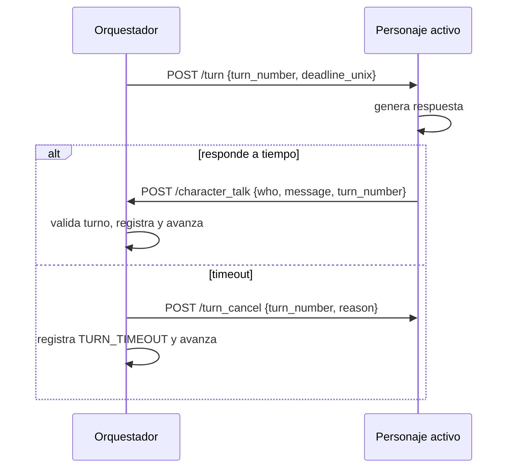

# PerSSim — Sistema de interacción multi-agente: Diseño técnico

## 1. Visión general

El sistema usa un único modo de interacción: **turnos secuenciales controlados por el orquestador**.

- El orquestador define el orden con `turn_order`.
- Cada turno tiene timeout central `turn_timeout_seconds`.
- Los personajes **no** tienen temporizadores locales.
- Un personaje solo habla cuando recibe `POST /turn`.

## 2. Flujo de turnos



## 3. Endpoints

### Orquestador

| Endpoint | Método | Descripción |
|---|---|---|
| `/character_talk` | POST | Recibe intervención del personaje activo; rechaza fuera de turno con 409. |
| `/next` | POST | Fuerza avanzar al siguiente o a `force_to`. |
| `/turn_status` | GET | Estado actual de turnos (`turn_order`, actual, número, deadline). |
| `/narrate` | POST | Envía narración del usuario a todos los personajes (`/listen`). |

### Personaje

| Endpoint | Método | Descripción |
|---|---|---|
| `/listen` | POST | Actualiza historial con mensajes distribuidos por el orquestador. |
| `/turn` | POST | Marca inicio de turno y dispara generación asíncrona. |
| `/turn_cancel` | POST | Cancela el turno vigente y evita publicar una respuesta tardía. |
| `/character_talk` | POST (saliente) | Envío de intervención al orquestador tras generar. |
| `/status` | GET | Estado básico del personaje. |

## 4. Configuración

### `session.config.json`

```json
{
  "session_id": "session_001",
  "log_path": "./logs/session_001.jsonl",
  "initial_situation": "París, 1635...",
  "turn_order": ["richelieu", "mazarin"],
  "turn_timeout_seconds": 30,
  "characters": [
    { "id": "richelieu", "host": "localhost", "port": 5001, "config": "./chars/richelieu.config.json" },
    { "id": "mazarin", "host": "localhost", "port": 5002, "config": "./chars/mazarin.config.json" }
  ]
}
```

### `char.config.json`

```json
{
  "character_id": "richelieu",
  "bundle_path": "./bundles/Bundle_Richelieu.md",
  "ollama_model": "llama3",
  "ollama_host": "http://localhost:11434",
  "orchestrator_host": "http://localhost:5000",
  "port": 5001
}
```

No se usan `wait_min_seconds` ni `wait_max_seconds`.

## 5. Reglas de validación de turno

- Si `who` en `/character_talk` no coincide con el personaje del turno actual: `409`.
- Si llega `turn_number` y no coincide con el turno esperado: `409`.
- En timeout se registra `TURN_TIMEOUT`, se envía `/turn_cancel` y se avanza.
- En error repetido al contactar `/turn`, se marca como no alcanzable y se avanza.
