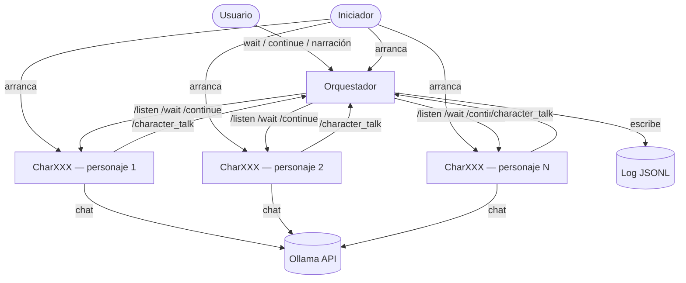
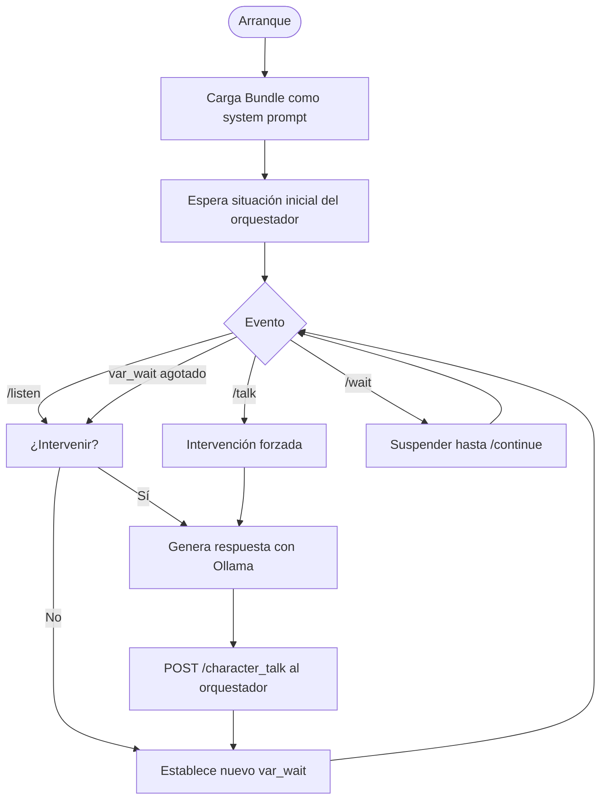

# PerSSim — Sistema de interacción multi-agente: Diseño técnico

## 1. Visión general

El sistema permite instanciar varios personajes históricos y hacer que dialoguen de forma autónoma o dirigida. Cada personaje corre como un proceso HTTP independiente y se comunica exclusivamente a través de un orquestador central, que actúa también como interfaz del usuario y registro de la conversación.

Objetivos de diseño:
- Ejecutarse completamente en local, usando modelos de Ollama.
- Configurable sin tocar código: personajes, modelo LLM y situación inicial se definen en ficheros JSON.
- Distribuible como paquete Python instalable (`persim-launch`).

---

## 2. Arquitectura



---

## 3. Componentes

### 3.1 Iniciador (`launcher.py`)

Script de arranque de sesión. Lee `session.json`, levanta cada proceso `CharXXX` y el orquestador como subprocesos independientes, espera a que todos los puertos estén listos y envía la situación inicial. Termina una vez hecho el arranque.

### 3.2 Orquestador (`orchestrator.py`)

Servidor FastAPI que actúa como hub central y narrador. Responsabilidades:

- Recibir intervenciones de los personajes vía `/character_talk`.
- Distribuir cada intervención a todos los personajes mediante `/listen`.
- Escribir el log de conversación en formato JSONL.
- Mostrar el diálogo en la interfaz de terminal (curses).
- Leer comandos del usuario por stdin.

### 3.3 Personaje (`char.py`)

Servidor FastAPI que representa a un único personaje. Cada instancia:

- Carga su `Bundle.md` como system prompt de Ollama al arrancar.
- Mantiene su propio historial de conversación con el modelo.
- Decide autónomamente si intervenir cuando expira `var_wait`.
- Se coordina exclusivamente a través del orquestador.

---

## 4. API de endpoints

### Orquestador

| Endpoint | Método | Descripción |
|---|---|---|
| `/character_talk` | POST | Un personaje informa de una intervención. El orquestador la registra y distribuye. |
| `/wait` | POST | Congela todos los personajes. |
| `/continue` | POST | Reanuda todos los personajes. |
| `/narrate` | POST | Envía un mensaje de narrador a todos los personajes vía `/listen`. |

### Personaje

| Endpoint | Método | Descripción |
|---|---|---|
| `/listen` | POST | Recibe un mensaje `(from, to[], message)`. El personaje decide si interviene. |
| `/talk` | POST | Fuerza una intervención inmediata. |
| `/wait` | POST | Congela el bucle interno. |
| `/continue` | POST | Reanuda el bucle interno. |
| `/status` | GET | Estado actual: activo, en pausa, último turno. |

---

## 5. Modelos de datos

### `/character_talk` — payload

```json
{
  "who":     "richelieu",
  "to":      ["mazarin"],
  "message": "Monsieur Mazarino..."
}
```

`to` vacío significa dirigido a todos.

### `/listen` — payload

```json
{
  "from":    null,
  "to":      [],
  "message": "Ha llegado un mensajero de Madrid."
}
```

`from` nulo indica que el mensaje es del narrador.

### Entrada de log (JSONL)

```json
{ "ts": "2025-01-15T14:32:01Z", "who": "richelieu", "to": ["mazarin"], "message": "..." }
```

---

## 6. Ficheros de configuración

### `session.json` (Orquestador)

```json
{
  "session_id": "session_001",
  "log_path":   "./logs/session_001.jsonl",
  "initial_situation": "París, 1635. El cardenal Richelieu y Mazarino se reúnen...",
  "characters": [
    { "id": "richelieu", "host": "localhost", "port": 5001, "config": "./chars/richelieu.json" },
    { "id": "mazarin",   "host": "localhost", "port": 5002, "config": "./chars/mazarin.json" }
  ]
}
```

### `char.json` (por personaje)

```json
{
  "character_id":      "richelieu",
  "bundle_path":       "./bundles/Bundle_Richelieu.md",
  "ollama_model":      "llama3",
  "ollama_host":       "http://localhost:11434",
  "orchestrator_host": "http://localhost:5000",
  "port":              5001,
  "wait_min_seconds":  30,
  "wait_max_seconds":  120
}
```

---

## 7. Bucles de ejecución

### Bucle del personaje



### Bucle del orquestador

```mermaid
flowchart TD
    A([Arranque]) --> B[Lee session.json]
    B --> C[Inicia log, registra personajes]
    C --> D[Envía situación inicial]
    D --> E{Espera}
    E -->|/character_talk| F[Escribe en log]
    F --> G[Muestra en TUI]
    G --> H[Distribuye /listen a todos]
    H --> E
    E -->|stdin: wait| I[/wait a todos los personajes]
    E -->|stdin: continue| J[/continue a todos los personajes]
    E -->|stdin: texto libre| K[/listen narrador a todos]
    I --> E
    J --> E
    K --> E
```

---

## 8. Estructura del paquete

```
persim-interact/
├── pyproject.toml
├── README.md
├── docs/
│   ├── design.md           ← este fichero
│   ├── install.md
│   └── usage.md
├── persim/
│   ├── __init__.py
│   ├── launcher.py         # Punto de entrada: persim-launch
│   ├── orchestrator.py     # Servidor FastAPI del orquestador
│   ├── char.py             # Servidor FastAPI del personaje
│   ├── ollama_client.py    # Wrapper async de la API de Ollama
│   ├── tui.py              # Interfaz de terminal (curses)
│   └── models.py           # Modelos Pydantic compartidos
├── config/
│   ├── session.example.json
│   └── char.example.json
└── logs/                   # Generado en tiempo de ejecución
```

---

## 9. Stack tecnológico

| Componente | Tecnología | Justificación |
|---|---|---|
| Servidor HTTP | FastAPI + Uvicorn | Async nativo; el bucle de `var_wait` se integra limpiamente con asyncio. |
| Cliente Ollama | httpx (async) | Streaming nativo; compatible con el loop async de FastAPI. |
| Validación datos | Pydantic v2 | Incluido en FastAPI; tipado estricto de payloads. |
| Interfaz terminal | curses (stdlib) | Sin dependencias extra; panel de log + input separados. |
| Log conversación | JSONL | Fácil de leer, filtrar y procesar con herramientas estándar. |
| Empaquetado | pyproject.toml (hatch) | Estándar moderno; genera el comando `persim-launch`. |

---

## 10. Plan de implementación

### Fase 1 — Infraestructura base

- `ollama_client.py`: wrapper async sobre la API de Ollama. `chat(system, messages) → str`. Sin estado.
- `models.py`: modelos Pydantic para todos los payloads (`CharacterTalkRequest`, `ListenRequest`, etc.).
- `char.py`: servidor mínimo. Carga Bundle, implementa `/listen` y `/talk`. Loguea a consola sin llamar al orquestador todavía.
- Prueba: `curl` manual a `/talk`. Verificar respuesta en personaje.

### Fase 2 — Orquestador

- `orchestrator.py`: implementa `/character_talk`, llama a `/listen` de todos, escribe JSONL.
- Conectar `char.py` → llama a `/character_talk` cuando decide intervenir.
- Prueba de integración: 2 personajes + orquestador lanzados manualmente.

### Fase 3 — Bucle autónomo y TUI

- Añadir `var_wait` al personaje: tarea `asyncio` que se dispara cuando el timer expira.
- `tui.py`: interfaz curses con panel superior (log) y panel inferior (input de usuario).
- Integrar TUI en el orquestador.

### Fase 4 — Iniciador y empaquetado

- `launcher.py`: lee `session.json`, lanza subprocesos, health-check de puertos, envía situación inicial.
- `pyproject.toml`: dependencias, punto de entrada `persim-launch`.
- Prueba de instalación limpia en entorno virtual desde cero.
